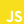

<h1 align="center">
  Hi, there! I'm Paulo Lima 🤘️
</h1>

   Working as a Front-end Engineer at <b><a href="https://www.grupoboticario.com.br/en/Pages/Home.aspx">Grupo Boticário</a></b> 👔️
    
   Living in <b>Curitiba</b>, <b>Parana</b>, <b>Brazil</b> &nbsp; 📌
    
   With a graduation in <b>System Analysis and Development</b> &nbsp; 📚️

<h3 align="center">
  My activities 📊️
</h2>

  
  &nbsp;
  

<h3 align="center">
  Technologies that I work 👨‍💻️
</h3>

   &nbsp;
   &nbsp;
   &nbsp;
   &nbsp;
   &nbsp;
   &nbsp;
   &nbsp;
   &nbsp;
   &nbsp;
   
   &nbsp;
  
   &nbsp;

<h3 align="center">
  Tools that I use 🖱️
</h3>

   &nbsp;
   &nbsp;
   &nbsp;
   &nbsp;
   &nbsp;
   &nbsp;
   &nbsp;
   &nbsp;
   &nbsp;
   &nbsp;

<h4 align="center">
  Where to find me 🗺️
</h4>

  <a
    href="https://paulophlp.github.io/portfolio/"
  >
     &nbsp;
  </a>
  <a
    href="https://www.linkedin.com/in/paulo-lima-1218a9149/" 
  >
     &nbsp;
  </a>
  <a
    href="mailto:plima.himself@gmail.com" 
  >
     &nbsp;
  </a>
  <a
    href="https://web.whatsapp.com/send?phone=+5541997835546" 
  >
     &nbsp;
  </a>
  <a
    href="https://www.instagram.com/pauleta_mexicana" 
  >
   &nbsp;
  </a>

