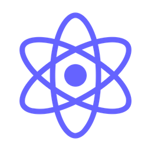

<h1 align="center">
  Hi, there! I'm Paulo Lima 🤘️
</h1>

   👔️ Working as a Full Stack Software Engineer at <b><a href="https://www.cinqtechnologies.com/">Cinq Technologies/Dextra Digital</a></b> 
    
   📌 Living in <b>Curitiba</b>, <b>Parana</b>, <b>Brazil</b> &nbsp; 
    
   📚️ Undergraduate in <b>System Analysis and Development</b> &nbsp;

<h3 align="center">
  Technologies that I work 👨‍💻️
</h3>

  
  
  
  
  
  
  
  

## Tools I use

## You can find me on

